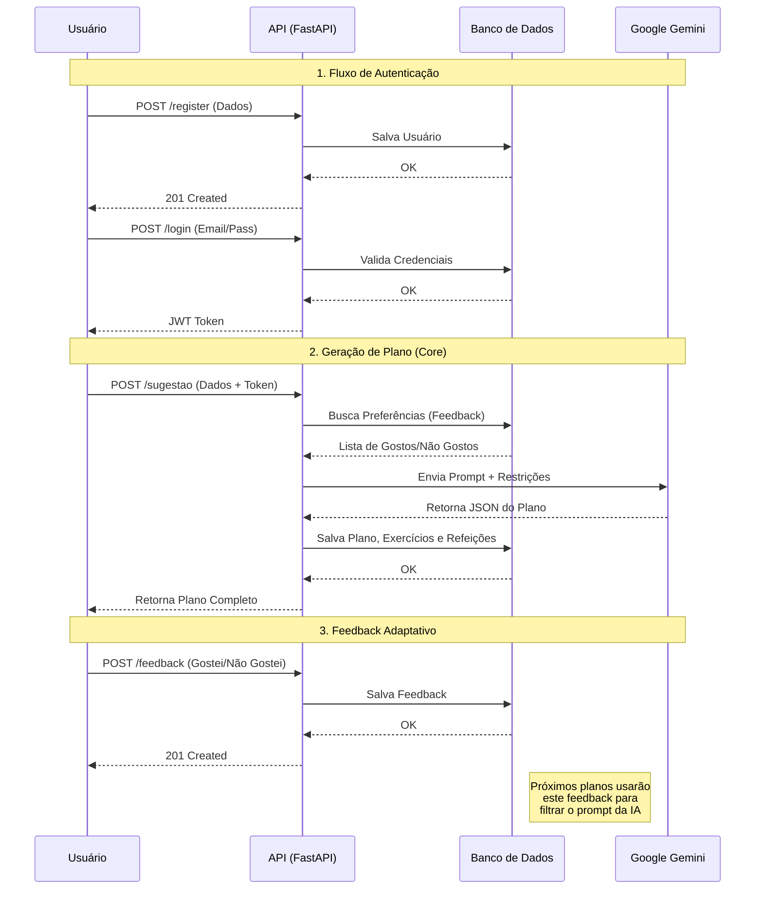

# 🔄 Fluxos da API AICan

Este documento detalha os principais fluxos de dados e interação do sistema backend.

## 1. Autenticação e Sessão

O sistema utiliza **JWT (JSON Web Tokens)** para autenticação stateless.

### Fluxo de Registro
1. **Cliente** envia `POST /api/v1/auth/register` com `email`, `password`, `nome`.
2. **Backend** verifica se o email já existe.
3. **Backend** cria hash da senha (bcrypt).
4. **Backend** salva usuário no banco (`usuarios`).
5. **Retorno**: 201 Created com dados do usuário (sem senha).

### Fluxo de Login
1. **Cliente** envia `POST /api/v1/auth/login` (OAuth2PasswordRequestForm) com `username` (email) e `password`.
2. **Backend** busca usuário e valida hash da senha.
3. **Backend** gera Token JWT com validade de 30 minutos.
4. **Retorno**: 200 OK com `access_token` e `token_type`.

---

## 2. Geração de Planos com IA

Este é o fluxo principal ("Core") da aplicação.

### Fluxo Completo
1. **Cliente** envia `POST /api/v1/sugestao` com dados físicos e preferências (`SugestaoCreate`).
    - *Header obrigatório*: `Authorization: Bearer <token>`
2. **Backend (API)**:
    - Valida dados de entrada (Enums, limites numéricos).
    - Chama `obter_preferencias_usuario(user_id)` para buscar histórico de feedbacks.
3. **Backend (IA Agent)**:
    - Constrói prompt enriquecido com:
        - Dados do usuário (IMC, idade, etc.).
        - **Restrições Críticas**: Lista de exercícios/refeições que o usuário "Não Gostou" anteriormente.
    - Envia prompt para **Google Gemini 2.5 Flash**.
    - *Retry*: Tenta até 3 vezes em caso de falha.
4. **Backend (Processamento)**:
    - Recebe JSON da IA.
    - Valida estrutura (campos obrigatórios).
    - Enriquece URLs de vídeo/receita se estiverem vazias.
5. **Backend (Persistência)**:
    - Salva `Plano` (cabeçalho).
    - Salva `PlanoDia` e `PlanoExercicio` (treinos).
    - Salva `PlanoRefeicao` (nutrição).
6. **Retorno**: 201 Created com o plano completo em JSON.

---

## 3. Sistema de Feedback Adaptativo

Permite que o sistema "aprenda" com o usuário.

### Fluxo de Avaliação
1. **Cliente** envia `POST /api/v1/feedback/exercicio` ou `/refeicao`.
    - Payload: `item_nome` (ex: "Burpee"), `gostou` (bool), `comentario` (opcional).
2. **Backend**:
    - Salva registro na tabela `feedbacks`.
    - `tipo` é definido automaticamente ("exercicio" ou "refeicao").
3. **Retorno**: 201 Created.

### Fluxo de Adaptação (Próxima Geração)
- Quando o usuário solicitar um novo plano (Fluxo 2), o sistema consultará a tabela `feedbacks`.
- Itens marcados com `gostou=False` serão inseridos no prompt da IA como **PROIBIDOS**.
- Itens marcados com `gostou=True` serão inseridos como **PREFERIDOS** (sugestão para manter).

---

## 4. Estrutura de Dados (Resumo)

### `usuarios`
- Conta e autenticação.

### `planos` -> `plano_dias` -> `plano_exercicios`
- Histórico de treinos gerados.

### `plano_refeicoes`
- Sugestões nutricionais vinculadas ao plano.

### `feedbacks`
- Registro de preferências (Gostei/Não Gostei) para personalização.

---

## 5. Diagrama Visual (Fluxograma)

